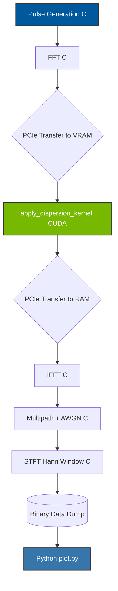

# WHISTLER: Heterogeneous VLF Wave Dispersion Engine


`The SpeedUp mentioned is bound to varry with testing situation, power, compute capability and hardware`

## Overview
**WHISTLER** is a high-performance, heterogeneous physics simulation engine designed to model the dispersion of Very Low Frequency (VLF) radio waves (whistlers) in the Earth's plasmasphere. Born from lightning strikes, these electromagnetic transients travel along Earth's magnetic field lines into space and back, getting dispersed such that higher frequencies arrive before lower frequencies. 

> Note: This project is an explicitly simplified engineering simulation utilizing a bounded frequency-dependent phase delay, not a full Earth magnetospheric cold-plasma wave solver.

This project implements a complete digital signal processing (DSP) pipeline that models this complex physical phenomenon from scratch—incorporating multi-path propagation, additive white Gaussian noise (AWGN), and Short-Time Fourier Transforms (STFT). By offloading the massive frequency-domain phase rotations to standard CUDA cores on the GPU, the engine achieves a **17.3x compute-path performance speedup** (when data is resident on the GPU), with a mathematically identical validation error of approximately $1.9 \times 10^{-6}$.

> 📖 **Read the Full Paper:** [WHISTLER: Computational Modeling of Lightning-Generated Whistlers](docs/paper.md)

## Tech Stack
* **Core DSP Engine:** C (Custom Radix-2 FFT, STFT, Hann Windowing, Pulse Generation, Box-Muller AWGN)
* **Compute Acceleration:** CUDA (Massively parallel frequency-domain phase dispersion)
* **Visual & Audio Processing:** Python (Matplotlib, Wave, Struct)

## Architecture / Pipeline
The engine executes a sequential data-flow pipeline designed to seamlessly pass memory buffers between the CPU and GPU:



1. **Pulse Generation (C):** A broadband damped transient simulating a lightning strike is generated in the time domain.
2. **Frequency Domain (C):** A custom Radix-2 FFT transforms the pulse into the frequency domain.
3. **Plasma Dispersion (CUDA):** The frequency bins are copied to the GPU. A massively parallel CUDA kernel applies the physical dispersion equation $\tau(f) = t_0 + D f^{-1/2}$ to rotate the phase of every bin simultaneously.
4. **Multipath & Noise (C):** The dispersed signal is returned to the CPU, converted back to the time domain via IFFT, combined with an attenuated secondary echo path, and injected with AWGN.
5. **STFT Spectrogram (C):** The engine chunks the signal using a Hann window and computes a rolling STFT to generate a raw waterfall array.
6. **Visualization & Audio (Python):** Python ingests the binary blobs to generate a 16-bit PCM `.wav` audio file, static high-resolution spectrograms, and dynamic animated GIFs.

## Repository Structure
```text
WHISTLER/
├── Makefile                 # C/CUDA build orchestrator
├── README.md                # Project overview and instructions
├── docs/
│   └── paper.md             # Full research paper and mathematical model
├── include/
│   └── whistler_core.h      # C/CUDA function prototypes and structs
├── src/
│   ├── core/                # C DSP Engine (FFT, STFT, Pulse, Noise)
│   ├── cuda/                # CUDA Kernels (Parallel Phase Dispersion)
│   └── python/              # Python plotting, animation, and audio generation
└── data/                    # Generated artifacts (.wav, .png, .gif, .bin)
```

## Reproduction Instructions

### 1. Environment & Prerequisites
To run the full heterogeneous pipeline, you need an environment with both a C/CUDA compiler stack and a Python environment for visualization.
* **Compiler:** `gcc` (for C host code) and `nvcc` (for CUDA device code, explicitly targeting `-arch=sm_75`).
* **Hardware:** Any NVIDIA GPU supported by your installed CUDA toolkit (Tested on Turing architecture SM_75 and newer). Tensor Cores are explicitly avoided for single-precision accuracy.
* **Python Environment:** Python 3.10+
  * *Libraries:* `numpy`, `matplotlib`, `scipy`

### 2. Building the Core Engine
Use the provided Makefile to compile the C and CUDA source files into the executable binary:
```bash
make clean
make
```

### 3. Executing the Pipeline & Tests
Run the compiled binary to execute the physics engine. It will output the CPU/GPU validation metrics, benching results, and dump the raw binary data into the `/data` directory:
```bash
./whistler_m1
```
This runs the default, hardcoded physics model. If you wish to parameterize the simulation environment dynamically, use the separated CLI module:
```bash
./whistler_cli -p 3 -n 0.01 -d 20.0
```
* `-p`: Number of Multipaths to simulate (default: 2)
* `-n`: AWGN Noise level (default: 0.005)
* `-d`: Base Dispersion Constant (default: 15.0)

You can also run the full deterministic regression test suite:
```bash
make test
```

### 4. Generating Visuals & Audio
Once the C/CUDA engine has dumped the binary files, execute the Python script to consume the data and generate the audio and spectrograms:
```bash
python src/python/plot.py
```
This will populate the `/data` folder with the final `whistler.wav`, `waterfall_static.png`, and `waterfall_animated.gif` artifacts.

## 5. Testing
The test suite consists of five core regression validations.

| Test | Description | Requires GPU? | Expected Outcome |
|------|-------------|---------------|------------------|
| **FFT/IFFT Round Trip** | Verifies the custom C FFT matches the original signal after IFFT. | No | Maximum error < `1e-4` |
| **CPU vs CUDA Equivalence** | Validates the GPU phase dispersion against the CPU scalar reference. | Yes | Mathematical parity (error ~ `1e-6`) |
| **Low-Frequency Stability** | Checks for singularities (NaN/Inf) at DC frequencies. | No | Passed (no NaNs) |
| **Full-Pipeline Regression** | Runs a deterministic end-to-end trace with a known checksum. | No | Passed (Checksum match) |
| **CUDA Kernel Scaling** | Assesses execution scaling of the GPU kernel across massive FFT sizes. | Yes | Output bounded scaling limits |

## 6. GPU / CUDA Information
CUDA (Compute Unified Device Architecture) is utilized because the frequency-dependent phase rotations ($\tau(f) = t_0 + D f^{-1/2}$) require independent, mathematically identical transcendental operations across tens of thousands of individual frequency bins. 

**Hardware Notes:**
* The codebase explicitly avoids Tensor Cores, standardizing on pure FP32 ALU execution to prevent matrix-multiply fast-math drift.
* The pipeline distinctly measures **GPU-resident compute speedups** (timed explicitly via `cudaEvent_t` at the kernel boundary) versus **End-to-End Execution** (which includes the PCIe VRAM transfer overheads via `cudaMemcpy` and is timed using `clock_gettime(CLOCK_MONOTONIC)` on the host).

## 7. Benchmark Methodology
* **FFT Size:** 16,384 bins.
* **Workload:** 100,000 iterations for resident benchmarking, 1,000 iterations for E2E benchmarking.
* **Hardware:** NVIDIA RTX 5060 (SM_120) was used to achieve the primary benchmark numbers. (Continuous Integration tests run on NVIDIA T4 (SM_75) Google Colab instances).
* **Result:** The **17.3x Speedup** represents the **compute-path / GPU-resident** execution velocity. The full E2E execution maintains a positive but smaller speedup due to PCIe bandwidth constraints.

## 8. GPU CI Infrastructure
To automatically test CUDA code in a Continuous Integration (CI) environment, this project utilizes a custom **self-hosted GPU runner**. 
Because standard GitHub-hosted runners lack NVIDIA hardware, the repository includes `colab_runner.ipynb`. By spinning up a free Google Colab T4 instance and executing the notebook, a temporary self-hosted GitHub Actions runner is securely connected to the repository to process the `gpu` CI job.

## 9. Binary Format Specification
The physics engine writes binary files using explicit 32-bit little-endian types for portability.
* **Audio (`data/audio.bin`)**:
  * Magic: `"WAVA"` (4 bytes)
  * Version: `1` (`int32_t`)
  * Sample Rate: `fs` (`float32`)
  * Length: `len` (`int32_t`)
  * Payload: `len` elements of IEEE-754 `float32` PCM data.
* **Spectrogram (`data/spectrogram.bin`)**:
  * Magic: `"SPEC"` (4 bytes)
  * Version: `1` (`int32_t`)
  * Sample Rate: `fs` (`float32`)
  * Frames: `N` (`int32_t`)
  * Bins: `M` (`int32_t`)
  * Payload: `N * M` elements of IEEE-754 `float32` data.

## 10. Reproducibility
* **Random Seed:** The regression tests use a deterministic seed (Custom Linear Congruential Generator starting at seed `42`).
* **Compilers:** Tested with `gcc 11+` and `nvcc` (CUDA 11.4+).
* **Hardware:** NVIDIA Turing Architecture (SM_75) or newer required.
* **Results Verification:** Running `make test` will validate mathematical fidelity. Running `./whistler_m1` will output the precise CPU and GPU runtime benchmarks.

## 11. Known Limitations
* **Frequency-Dependent Delay Model:** This is an explicit, localized engineering simulation utilizing a bounded frequency-dependent phase delay, not a full Earth magnetospheric cold-plasma wave solver.
* **Numerical Approximations:** The single-precision (IEEE-754 binary32) formats can exhibit minor platform-dependent drift (error bounded to $<10^{-4}$).

## Conclusion
WHISTLER demonstrates the sheer computational power of heterogeneous architectures for physics modeling. By delegating purely parallel arithmetic to the GPU and keeping sequential orchestration and signal structuring on the CPU, we drastically reduced execution time while maintaining strict numerical parity. It stands as a robust artifact of low-level digital signal processing, high-performance computing, and cross-language integration.

## License
This project is licensed under the MIT License - see the [LICENSE](LICENSE) file for details.
