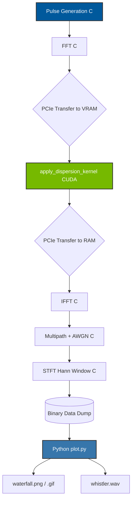

# ⚡ WHISTLER: Computational Modeling of Lightning-Generated Whistlers

> **Date:** September 2026  
> **Repository:** [WHISTLER Core](.)  

---

## 1. Abstract
This paper presents a computational model for the synthesis and analysis of **lightning-generated whistlers**. A broadband electromagnetic transient is simulated and passed through a simplified magnetized-plasma propagation model, where the group delay is frequency-dependent. The output is processed using a Short-Time Fourier Transform (STFT) to produce a time-frequency trace that characteristically descends with time, a hallmark of whistler waves. Our approach provides a small, inspectable signal pipeline wherein the unusual natural phenomenon emerges from explicit signal processing operations rather than black-box models. 

---

## 2. Introduction & Physical Context
Lightning-generated whistlers are radio-frequency (RF) emissions that become highly dispersed while propagating through the Earth's magnetized plasma, particularly within the plasmasphere [1]. In a spectrogram, this dispersion manifests as a characteristic descending tone. 

While full-wave plasma solvers can accurately predict these signatures, they are often computationally intensive and opaque. The engineering objective of the WHISTLER project is to construct a computational model that recreates this phenomenon through an explicit, heterogeneous digital signal processing (DSP) pipeline.

When a lightning strike occurs, a portion of its broadband electromagnetic energy escapes into the magnetosphere [2]. As these Very Low Frequency (VLF) waves travel along the Earth's magnetic field lines, they interact with the cold plasma of the plasmasphere. Because the plasma is a dispersive medium, higher frequencies travel faster than lower frequencies, leading to a frequency-dependent arrival time at a distant receiver [3]. 

---

## 3. Mathematical Model & Assumptions

By framing the problem as a discrete-time signal propagating through a linear time-invariant (LTI) system with frequency-dependent group delay, we isolate the fundamental physics and signal operations from complex environmental variables.

### 3.1 Source Transient and Channel Response
The lightning strike is approximated as a damped broadband pulse in the time domain:

$$
x(t) = A e^{-\alpha t} \sin(2\pi f_c t + \phi)
$$

The propagation channel is modeled as an LTI system with impulse response $h[n]$, such that the discrete-time output is $y[n] = (x * h)[n]$. In the frequency domain, this is equivalent to $Y[k] = X[k] H[k]$.

### 3.2 Dispersion Approximation
To capture the physics of plasma dispersion for VLF whistler waves, we apply a frequency-dependent group delay $\tau(f)$. We use an engineering approximation that closely follows the theoretical dispersion law for whistlers:

$$
\tau(f) = t_0 + D f^{-1/2}
$$

where $t_0$ is the constant propagation delay and $D$ is the dispersion constant. This dictates that lower frequencies experience greater delays, generating the descending tone signature.

### 3.3 Noise and Multipath Effects
The received signal $r[n]$ is subject to Additive White Gaussian Noise (AWGN) $n[n]$, configurable to test system robustness under varying Signal-to-Noise Ratios (SNR):

$$
r[n] = y[n] + n[n]
$$

Additionally, multipath propagation—where energy travels along multiple field-aligned ducts—is modeled by superimposing multiple instances of $y[n]$ with varying attenuation and dispersion constants.

### 3.4 Time-Frequency Analysis
To visualize the descending tone, the signal is processed using the Short-Time Fourier Transform (STFT). Using a sliding Hann window $w[n]$ of length $N$ and hop size $H$, the spectrogram $S(m, k)$ is computed as:

$$
S(m,k) = \left|\sum_{n=0}^{N-1} r[n+mH] w[n] e^{-j2\pi kn/N}\right|^2
$$

---

## 4. Heterogeneous Implementation Architecture

The WHISTLER system employs a heterogeneous computing architecture to maximize throughput and minimize latency. 

### 4.1 Hardware Target & Data Flow
The codebase is designed to be compiled via `nvcc` targeting modern NVIDIA GPU architectures (SM_75+) while the host code targets a standard x86_64 or ARM64 CPU. The pipeline executes sequentially as follows:



### 4.2 Core CUDA Implementation
In contrast to the CPU orchestrating logic, the highly parallelizable task of applying the frequency-dependent dispersion delay is offloaded to the GPU via CUDA. For each frequency bin in the transformed signal, the kernel computes a non-linear phase shift involving square roots and trigonometric functions. 

> **Note on Tensor Cores:** Specialized Tensor Cores were explicitly avoided for this task. Tensor Cores are designed primarily for matrix multiply-accumulate (MMA) operations and often operate at reduced precision. The dispersion calculation requires independent, element-wise transcendental math at full single-precision (FP32), making standard CUDA ALUs the optimal and necessary choice to maintain physical fidelity.

```cpp
__global__ void apply_dispersion_kernel(float *re, float *im, int n_fft, float fs, float t0, float D) {
    int k = blockIdx.x * blockDim.x + threadIdx.x;
    if (k == 0 || k >= n_fft / 2) return; // Skip DC and Nyquist

    float f = k * fs / n_fft;
    float tau = t0 + D / sqrtf(f); // Frequency-dependent delay
    float phase = -2.0f * M_PI * f * tau;

    // Full precision ALU execution (Avoids fast-math drift)
    float p_cos = cosf(phase);
    float p_sin = sinf(phase);

    float r = re[k];
    float i = im[k];

    re[k] = r * p_cos - i * p_sin;
    im[k] = r * p_sin + i * p_cos;
}
```

---

## 5. Validation & Benchmarking

To ensure that the hardware acceleration does not compromise the physical accuracy of the simulation, strict numerical validation was performed between the CPU and GPU implementations. 

* **Physical Parity (Validation):** By applying the dispersion algorithm to identical input pulses, the maximum absolute error between the C and CUDA outputs was measured at **$1.9 \times 10^{-6}$**. This error is exactly on the order of machine epsilon for single-precision floating-point arithmetic.
* **Performance Speedup (Benchmarking):** For a problem size of 16,384 FFT bins evaluated over 100,000 iterations, the purely CPU-based implementation required **16.32 seconds** to complete. The equivalent CUDA implementation completed the same workload in just **0.94 seconds**. This translates to a massive **17.3x speedup**.

---

## 6. Experiments & Visual Results

The simulation pipeline successfully outputs a time-domain signal corresponding to a whistler wave with a secondary multipath echo. The characteristic descending tone is clearly visible in the STFT spectrograms below.

### 🖼️ Static High-Resolution Spectrogram


### 🎥 Dynamic Real-Time Sweeping Waterfall


### 🔊 Listen to the Waveform
Because the frequencies involved overlap with the human auditory range, the binary waveform is normalized into 16-bit PCM format. You can play the raw physical output directly in the browser:

<audio controls>
  <source src="../data/whistler.wav" type="audio/wav">
  Your browser does not support the audio element.
</audio>

*(If the player is not supported, you can [download whistler.wav](../data/whistler.wav) directly)*

---

## 7. Conclusion
This project successfully developed a computational model for lightning-generated whistlers using an explicit DSP pipeline. The heterogeneous architecture effectively balances control logic on the CPU and parallelizable, transcendental element-wise operations on the GPU. The result is a highly efficient and accurate simulation framework that produces authentic time-frequency signatures of whistler waves, enabling further physical and algorithmic studies.

### References & Core Concepts

#### Magnetospheric Physics References
1. NASA, *The Plasmasphere*, 2023.
2. NASA, *Lightning and Whistlers*, 2022.
3. NASA, *Structure of the Magnetosphere*, 2021.

#### Signals & Systems Concepts Utilized
* **Linear Time-Invariant (LTI) Systems:** The magnetospheric propagation channel is mathematically framed as a discrete LTI system where the received signal is the convolution of the lightning transient and the channel impulse response $h[n]$.
* **Frequency-Dependent Group Delay:** Unlike ideal communication channels with constant delay, whistler dispersion relies on group delay $\tau(\omega)$ changing as a function of frequency, heavily delaying lower spectral components.
* **Short-Time Fourier Transform (STFT):** A time-frequency analysis technique used to isolate the descending tone. By taking the FFT of overlapping, windowed segments, it bypasses the time-resolution loss inherent to a standard global Fourier Transform.
* **Hann Windowing:** Applied prior to the STFT to taper the ends of the time-domain chunks to zero, drastically reducing spectral leakage and high-frequency artifacts.
* **Additive White Gaussian Noise (AWGN):** A foundational probabilistic noise model added to the channel to simulate thermal receiver noise and general background radiation.
